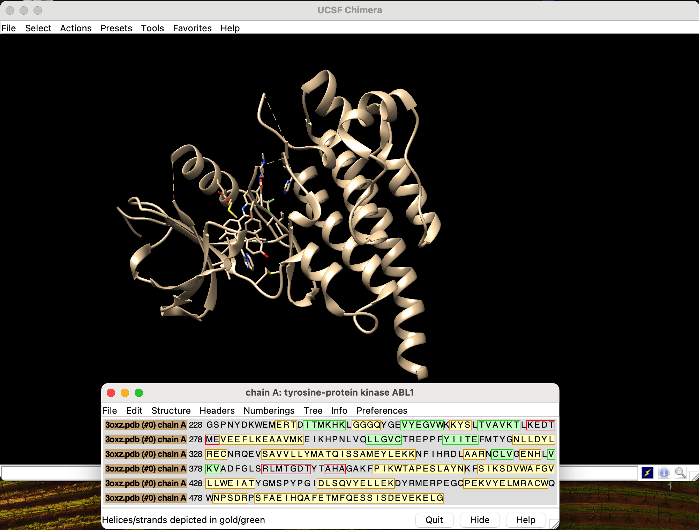
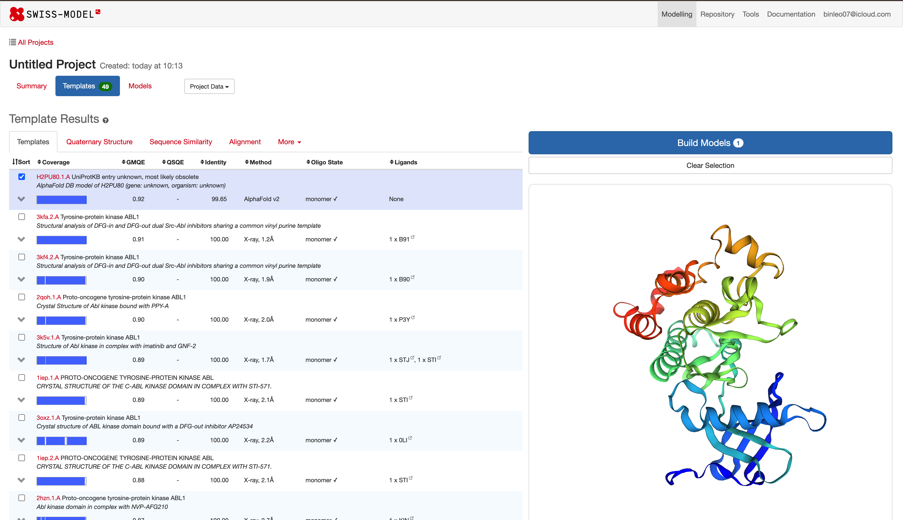
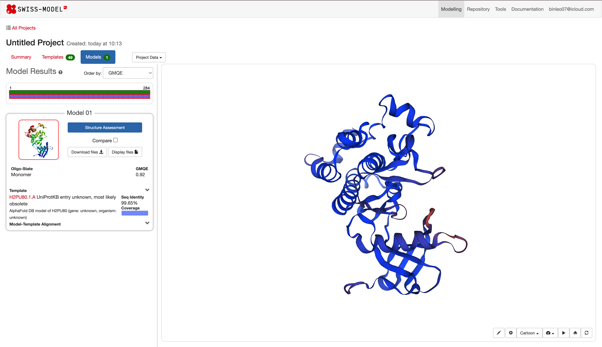
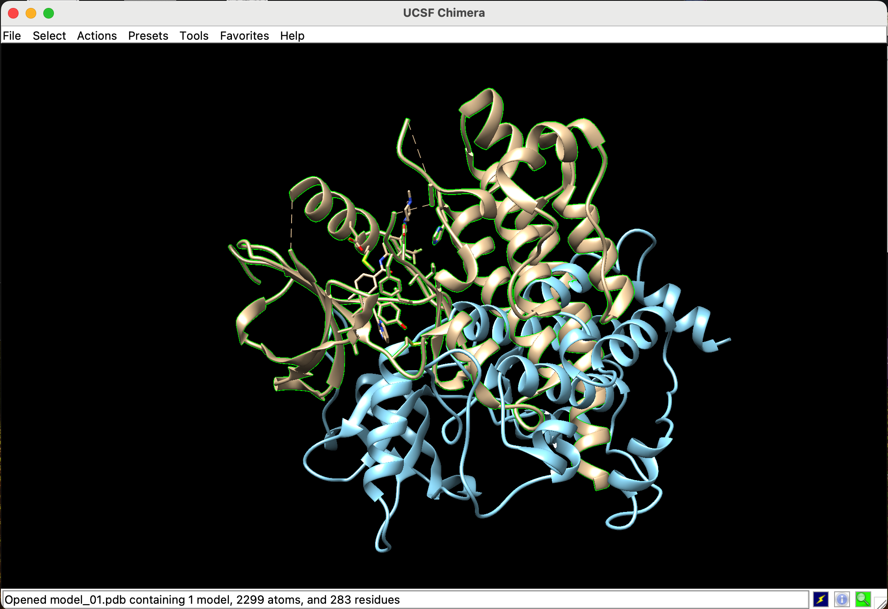
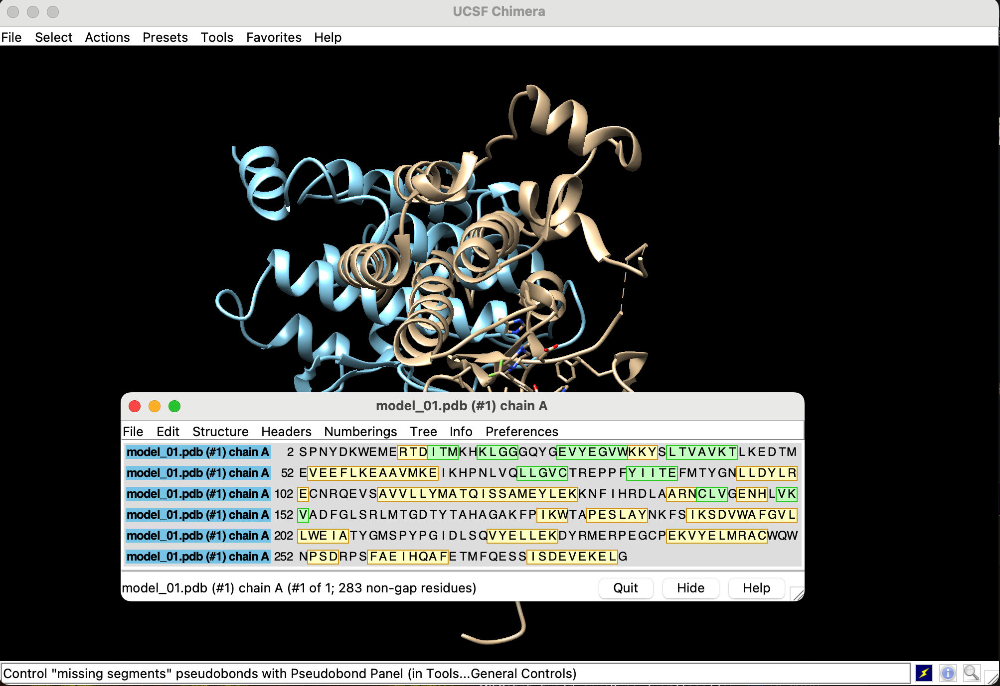
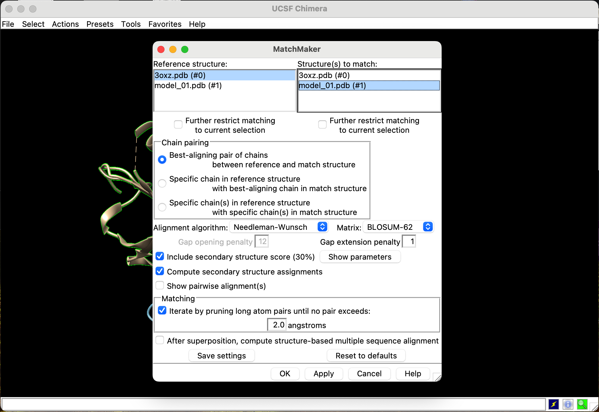
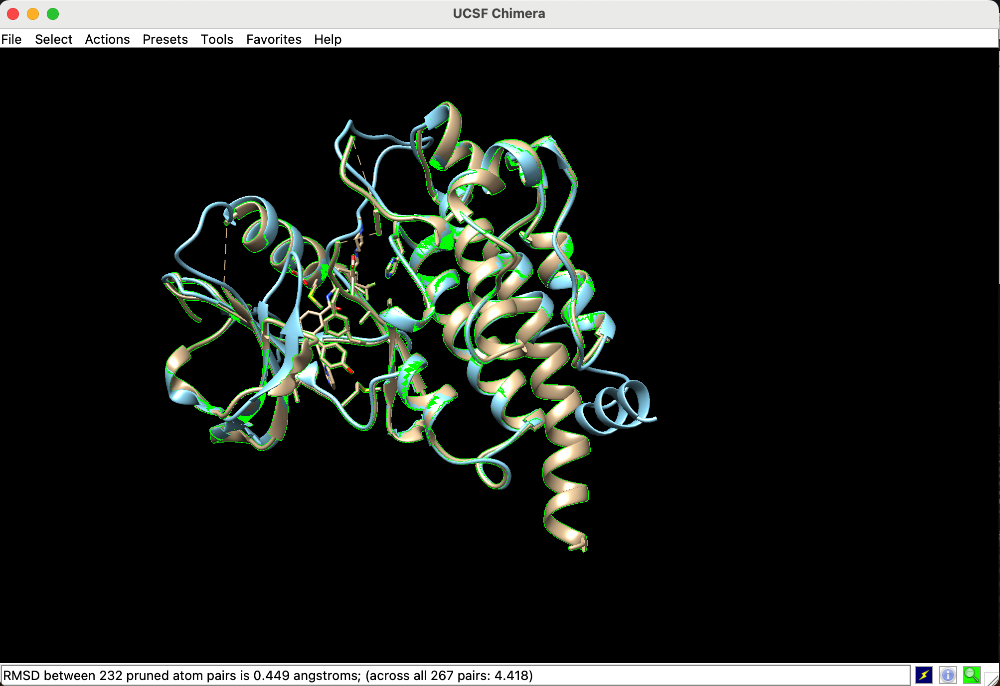

# Lab 1

1) Download .PDB from [3OXZ](https://www.rcsb.org/structure/3OXZ)
2) Open the file in the Chimera (File->Open)  

4) Моделирование по гомологии - это процесс получения 3D-структуры белка с помощью различных алгоритмов на основе уже известных гомологичных структур - родственных белков.
5) Далее нужно зайти в swiss model (binleo07@icloud.com/bPb29H), вставить последовательность из Chimera
6) Что делает [Swiss Model](https://swissmodel.expasy.org/interactive/SUkY4d/templates/):
   1) Поиск в PDB последовательности которая ближе всего к нашей (входной)
   2) Моя последовательность выравнивается (заполнение разрывов путем сравнения похожих участков (гомология)) 
   3) Строится 3d модель моего белка
7) Какие модели и их качества  

8) Модель с наивысшим GMQE  
GMQE (Global Model Quality Estimate) - это оценка качества, которая объединяет свойства согласования целевого шаблона и структуры шаблона.  

9) Результаты, почему разрывы все равное есть? То-есть как я понимаю в model_01 не должно быть пробелов, то-есть в sequence должно быть все зеленое  

