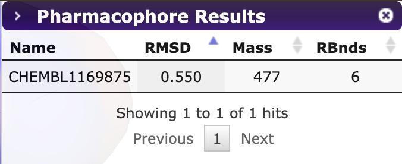

# Определения 
 * Рациональный драг-дизайн (rational drug design) — это метод разработки лекарственных препаратов, при котором новые лекарства разрабатываются на основе знаний о биологических мишенях, связанных с заболеванием.

# Основные термины:
 * Мишень (target) — это биомолекула, которая участвует в развитии заболевания и на которую предполагается воздействовать лекарственный препарат. Чаще всего мишенями являются белки, такие как ферменты, рецепторы или транспортные белки, а также ДНК или РНК.
 * Лиганда (ligand) — это молекула, которая связывается с мишенью, воздействуя на её активность. В контексте рационального драг-дизайна лиганда — это потенциальный лекарственный препарат или его прототип, который взаимодействует с мишенью и модифицирует её функцию.
 * Ингибиторы — это вещества, которые подавляют или замедляют активность определенных биологических процессов
 * Функциональная группа — это определённый набор атомов в молекуле, который придаёт ей характерные химические свойства и определяет её реакционную способность.
 * Фармакофор — это абстрактная концепция, представляющая совокупность структурных элементов молекулы, необходимых для её взаимодействия с биомишенью.
 * Пр-ло Лепинского (пяти) — Согласно данному правилу соединение с бОльшей вероятностью НЕ сможет выступать в роли лекарства, если кол-во доноров водородной связи > 5, акцепторов > 10, молекулярная масса > 500 Да и коэффициент липофильности LogP > 5.

## Выполнение лабораторной:
1) https://pharmit.csb.pitt.edu/
2) Model 3OXZ  

3) Выставить правило Липинского (Filters->Hit screening)  
Согласно данному правилу соединение с бОльшей вероятностью НЕ сможет выступать в роли лекарства, если кол-во доноров водородной связи > 5, акцепторов > 10, молекулярная масса > 500 Да и коэффициент липофильности LogP > 5.  

4) Ищем потенциальные ингибиторы  

5) Минимизируем  
Минимизированные результаты сортируются по предсказанной аффинности связывания (ккал/моль), чем она меньше, тем лучше. Также подсчитывается mRMSD (RMSD между позой найденного по запросу соединения и его минимизированной версией)  
Чтобы исключить соединения с большим отклонением от исходной позы и слабой аффинностью связывания в Pharmit для данных параметров предусмотрены фильтры  

6) Сохраняем файл в формате sdf.
