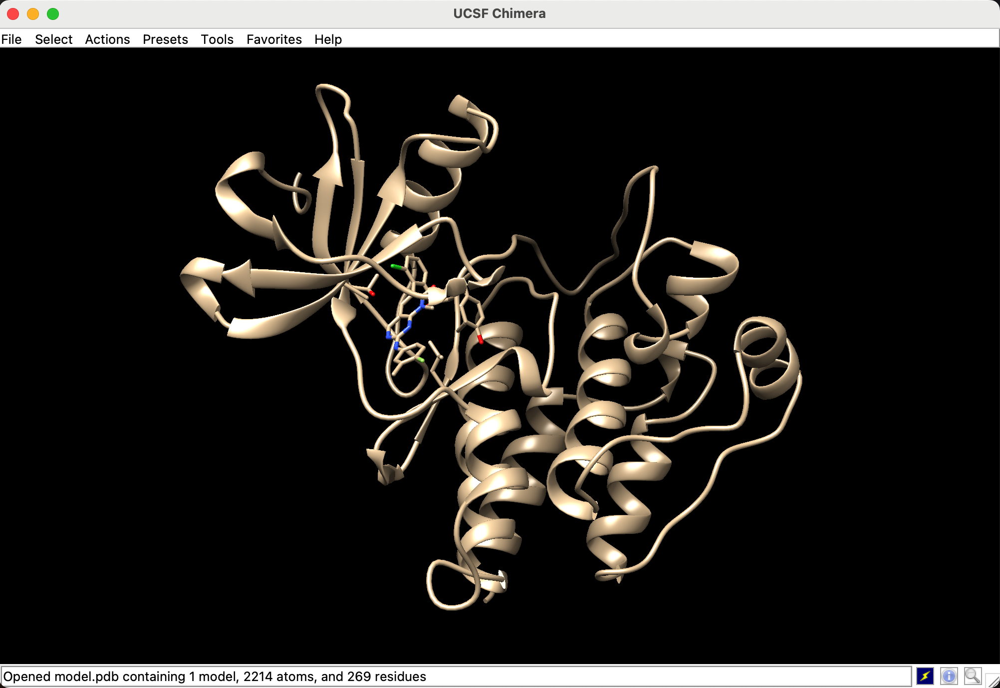

# Lab5

__Молекуля́рный до́кинг__ — метод молекулярного моделирования, позволяющий предсказать наиболее выгодную для образования устойчивого комплекса ориентацию и конформацию одной молекулы (лиганда) в сайте связывания другой (рецептора).

Докинг можно представить следующими этапами:
 * подготовка лиганда
 * подготовка мишени 
 * задание параметров докинга
 * запуск докинга и оценка результатов

1) Скачали белок 3cs9 через [ссылку](https://www.rcsb.org/structure/3CS9)
2) Оставили одну последовательность  
В данном случае у нас 4 цепи, оставляем только одну. Удаляем молекулы воды. Помимо молекул воды могут встречаться ионы, не интересующие нас лиганды и др.  

3) Cохранили лиганд в 3cs0_ligand.pdb
4) Удалили лиганд с 3cs9. Сохраняем отдельно белок.
5) Проверили пропуски в последовательности  

5) Взяли последовательность белка и восстановили от пробелов используя swiss model с лабы 2
6) Получили файл model.pdb  

7) Подготовили лиганд, добавили атомы водорода и заряды  

8) получили 3cs9_ligand_H_charge.pdb  

9) Добавили H и Charge в мишень model без пробелов, получили 3cs9_model_charge_H