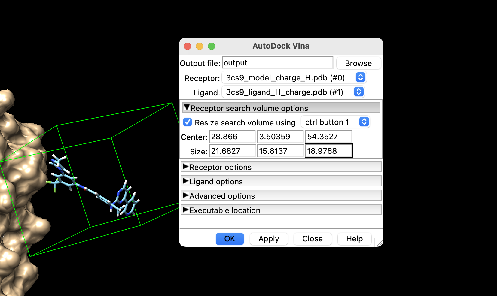

Алгоритм поиска помещает молекулу лиганда в различных конформациях в активный сайт рецептора. Для этого нужно выделить область активного сайта (задать объем конформационного пространства) и определить количество генерируемых алгоритмом конформаций (задать охват конформационного пространства). Чтобы задать область активного сайта используют “коробку для докинга” (docking box / grid box) - параллелепипедная область.

3 вида докинга:  
жесткий - конформации Р и Л фиксированы  
полужесткий - конформация Р фиксирована (или частично фиксирована), Л гибкая  
гибкий - конформации Р и Л гибкие  

Отсюда следуют 3 важнейших параметров докинга:
 * координаты центра коробки (ангстрем): __center_x__, __center_y__, __center_z__
 * размеры коробки (ангстрем): __size_x__, __size_y__, __size_z__
 * параметр охвата конформационного пространства (кол-во проверяемых конформаций): __exhaustiveness__  (default = 8)

# Выполнение лабы
1) Открыл мишень и лиганд в одной chimera сессии

2) Показываю surface

3) Задаю параметры для докинга и устанавливаю бинарь vina

Так как мы уже осуществили подготовку входных файлов, то Receptor options и Ligand options можно установить на false.  
Далее идут параметры:
num_modes - максимальное кол-во выводимых наилучших конформаций,  
exhaustiveness,  
energy_range - максимальное отклонение от лучшей оценки энергии связывания, если конформация превышает эту оценку, то она отбрасывается  

4) Получил файлы pdbqt, проверяю их