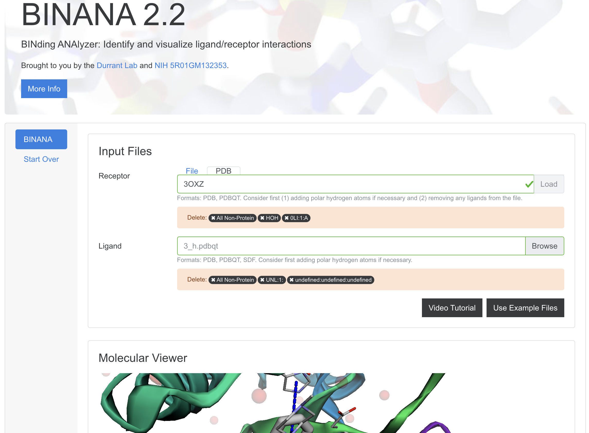
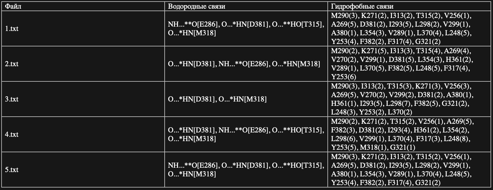

# Lab 8

Для грамотной интерпретации результатов и отбора лучших соединений нам нужно установить следующие параметры : водородные связи и гидрофобные контакты.

Водородная связь — форма ассоциации между электроотрицательным атомом и атомом водорода H, связанным ковалентно с другим электроотрицательным атомом. В качестве электроотрицательных атомов могут выступать N, O или F. Водородные связи могут быть межмолекулярными или внутримолекулярными.

Гидрофобные контакты - это способ организации неполярных участков молекул друг с другом в присутствии полярного растворителя.

1) Go to binana, put ligand and protein like on  

2) download log.txt
3) Do:
```py
cd task 8/dir
python3 run_parsing.py
```
4) check out parser_out  
